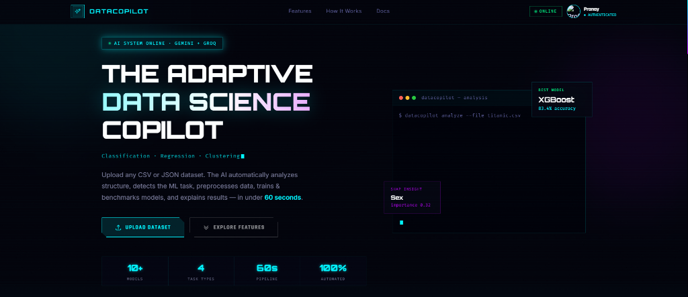
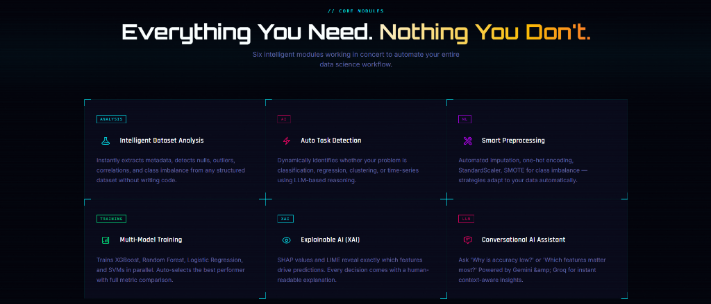
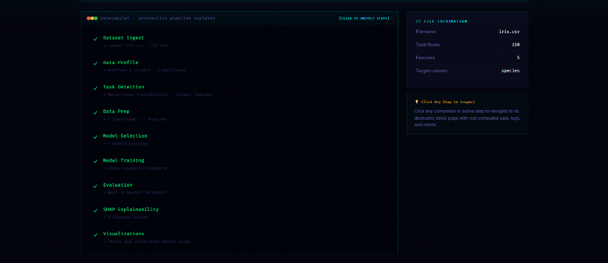
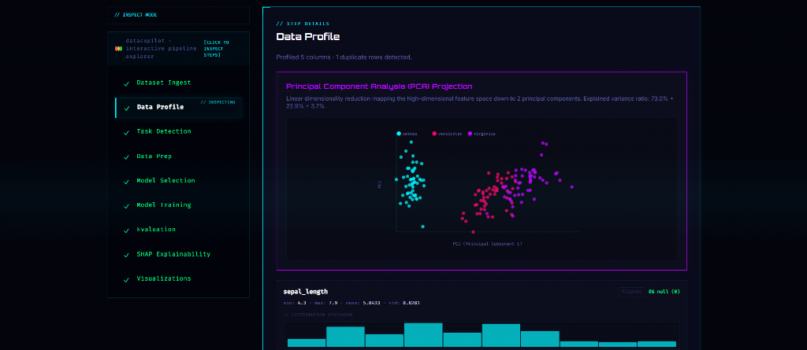
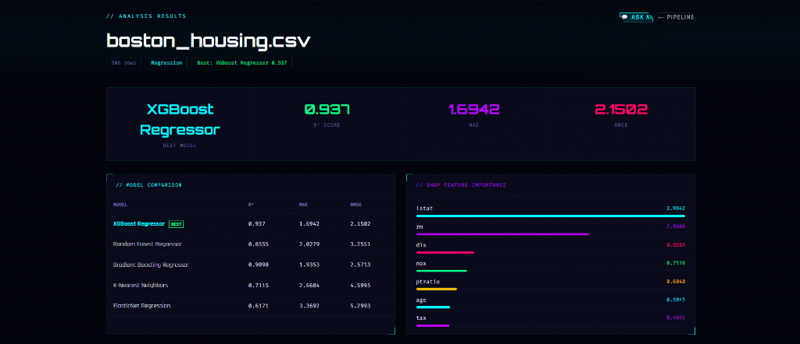
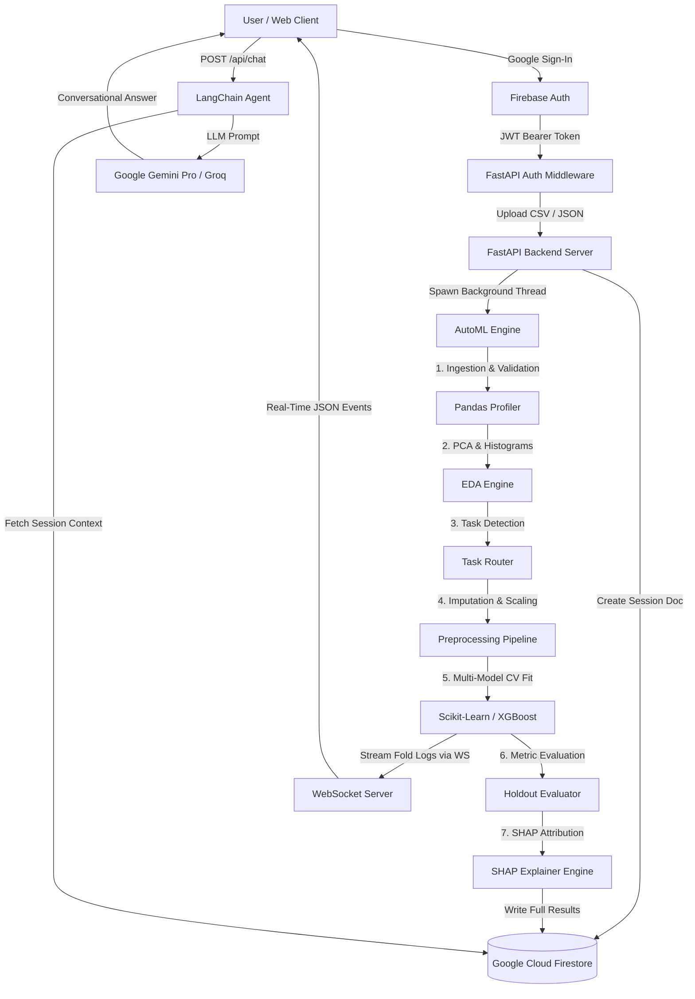

# 🚀 DataCopilot — The Adaptive Data Science Copilot



[](https://fastapi.tiangolo.com/)
[](https://nextjs.org/)
[](https://www.typescriptlang.org/)
[](https://www.python.org/)
[](https://xgboost.readthedocs.io/)
[](https://scikit-learn.org/)
[](https://firebase.google.com/)
[](https://ai.google.dev/)
[](https://groq.com/)

**DataCopilot** is a production-ready, full-stack **Automated Machine Learning (AutoML)** and **Explainable AI (XAI)** platform. It bridges high-fidelity statistical modeling with automated preprocessing, multi-model cross-validation, SHAP feature attribution, and an LLM-driven Chat Copilot — enabling domain experts to train, benchmark, visualize, and query complex machine learning models in under 60 seconds using natural language.

---

## 🌟 Core Capabilities



### 1. 🔍 Intelligent Dataset Analysis & EDA
* **Automated Profiling:** Automatically detects data types, missing value percentages, duplicate counts, continuous variable quantiles (mean, min, max, std), and categorical frequency distributions.
* **Dimensionality Reduction:** Computes 2D **Principal Component Analysis (PCA)** projections with explained variance ratios for multi-dimensional feature space visualization.
* **Distribution Histograms:** Generates feature-level distribution histograms for fast data quality checks.

### 2. ⚡ Automated Task Classification
* **Smart Target Inference:** Scans column headers against semantic hints (e.g. `target`, `label`, `churn`, `price`, `species`) or defaults to unsupervised clustering if no target is present.
* **Temporal Scanning:** Detects datetime types or temporal header keywords (`date`, `timestamp`, `year`) to route sessions to Time Series forecasting workflows.
* **Dynamic Objective Routing:** Automatically categorizes tasks into **Binary Classification**, **Multi-class Classification**, **Regression**, **Clustering**, or **Time Series**.
* **Imbalance Diagnostics:** Flags imbalanced datasets when the majority class represents $>75\%$ of samples, triggering class-weight balancing.

### 3. 🛠️ Smart Feature Preprocessing
* **High-Sparsity Pruning:** Drops columns with $>75\%$ missing values to eliminate noise.
* **Automated Imputation:** Imputes continuous variables with column medians and categorical variables with column modes.
* **Adaptive Feature Encoding:** One-Hot Encodes low-cardinality categoricals ($\le 10$ unique levels) and Label Encodes high-cardinality features.
* **Feature Scaling:** Standardizes continuous numeric features to zero mean and unit variance using Scikit-Learn's `StandardScaler`.

### 4. 🏆 Multi-Model Competitive Benchmark Training
* **Task-Tailored Search Space:** Evaluates candidate algorithms including **XGBoost**, **Random Forest**, **Gradient Boosting**, **Logistic/Linear Regression**, **ElasticNet**, **Naive Bayes**, **K-Nearest Neighbors (KNN)**, and **MLP Neural Networks**.
* **Threaded Execution:** Runs CPU-bound model fitting in a FastAPI background thread pool (`run_in_executor`) to ensure non-blocking server performance.
* **Cross-Validation Protection:** Applies dynamic $K$-Fold split sizing ($K = \min(5, \max(2, N/30))$) with `StratifiedKFold` for classification and `TimeSeriesSplit` for temporal datasets.
* **Real-time WebSocket Streaming:** Streams fold-by-fold execution logs and scores live to the client interface.

### 5. 💡 Explainable AI (XAI) & SHAP Feature Attribution
* **Multi-Tier SHAP Architecture:**
  1. `TreeExplainer` for tree-based ensemble models (XGBoost, Random Forest, Gradient Boosting).
  2. `KernelExplainer` for non-tree models (KNN, MLP) using background sampling.
  3. Native `feature_importances_` fallback.
  4. Absolute linear weight `coef_` fallback.
* **Ranked Feature Drivers:** Ranks top feature drivers to explain global model behavior transparently.

### 6. 💬 Conversational AI Assistant (LangChain + Gemini / Groq)
* **Context-Aware Querying:** Spawns a conversational agent loaded with dataset metadata, baseline profiles, evaluation metrics, and SHAP feature rankings.
* **Dual LLM Engine:** Powered by **Google Gemini Pro** (primary reasoning engine) with automatic failover to **Groq Llama-3-70b**.
* **Natural Language Analytics:** Answers complex questions such as *"Why is accuracy lower on class 0?"*, *"Which features drive the predictions?"*, or *"Give me business recommendations based on these results."*

---

## 🛠️ Interactive Pipeline Explorer & UI Showcase

DataCopilot features a state-of-the-art cyberpunk dark UI built with Next.js, Tailwind CSS, and Lucide Icons.

### 📍 Interactive 9-Step Pipeline Explorer
Track the live progress of dataset ingestion, statistical profiling, task detection, data prep, model selection, training, evaluation, SHAP explainability, and visual charting.



---

### 📍 Statistical Profiling & PCA Dimensionality Reduction
Inspect full dataset diagnostics, column-by-column null ratios, PCA 2D projections, and individual feature histograms.



---

### 📍 Model Leaderboard & SHAP Feature Attribution Dashboard
View the overall best model, detailed metric breakdown tables (R², MAE, RMSE, Accuracy, F1-Score, AUC), and interactive SHAP feature importance charts.



---

## 📐 System Architecture



---

## 📂 Repository Structure

```
ABB/
├── backend/
│   ├── main.py                  # FastAPI server, REST & WebSocket endpoints
│   ├── automl.py                # Core 9-step AutoML engine (profiling, CV, SHAP)
│   ├── auth_middleware.py       # Firebase ID token verification middleware
│   ├── firebase_admin_setup.py  # Firebase Admin SDK initialization
│   ├── session_store.py         # In-memory and Firestore session management
│   ├── chat_agent.py            # LangChain agent powered by Gemini Pro & Groq
│   ├── data_provider.py         # Sample demo dataset manager
│   ├── requirements.txt         # Backend Python dependencies
│   ├── Dockerfile               # Production container config
│   └── serviceAccountKey.json   # Firebase Admin credentials (local dev)
├── frontend/
│   ├── src/
│   │   ├── app/                 # Next.js App Router (Analysis, Results, Chat, Dashboard)
│   │   ├── components/          # Cyberpunk UI components (Pipeline, SHAP, Stats)
│   │   ├── context/             # AuthContext (Firebase) & SessionContext (WS)
│   │   └── lib/                 # Firebase client SDK initialization
│   ├── public/screenshots/      # UI Showcase images
│   ├── package.json             # Frontend dependencies
│   └── tailwind.config.js       # Styling configuration
├── docs/
│   └── screenshots/             # Documentation screenshots
├── DataCopilot_Submission.pdf   # 5-Page Technical Challenge Submission (PDF)
├── DataCopilot_Submission.docx  # 5-Page Technical Challenge Submission (Word)
└── README.md                    # Project Documentation
```

---

## ⚡ Quick Start Guide

### Prerequisites
* **Python:** `^3.10`
* **Node.js:** `^18.0.0`
* **Firebase Account:** Firebase Project with Google Auth & Firestore enabled
* **API Keys:** Google Gemini API Key or Groq API Key

---

### 1. Backend Setup

```bash
# Navigate to backend directory
cd backend

# Create & activate a virtual environment
python -m venv venv
# On Windows:
.\venv\Scripts\activate
# On Mac/Linux:
source venv/bin/activate

# Install dependencies
pip install -r requirements.txt

# Create environment configuration file
cp .env.example .env
```

Configure your `.env` file in `backend/`:
```env
GEMINI_API_KEY=your_google_gemini_api_key
GROQ_API_KEY=your_groq_api_key
FIREBASE_SERVICE_ACCOUNT_PATH=./serviceAccountKey.json
```

Place your Firebase Admin SDK JSON file in `backend/serviceAccountKey.json`.

Start the FastAPI server:
```bash
uvicorn main:app --host 0.0.0.0 --port 8000 --reload
```
The backend will run on `http://localhost:8000`.

---

### 2. Frontend Setup

```bash
# Navigate to frontend directory
cd frontend

# Install Node dependencies
npm install

# Create local environment configuration file
cp .env.local.example .env.local
```

Configure your `.env.local` file in `frontend/`:
```env
NEXT_PUBLIC_FIREBASE_API_KEY=your_firebase_api_key
NEXT_PUBLIC_FIREBASE_AUTH_DOMAIN=your_project.firebaseapp.com
NEXT_PUBLIC_FIREBASE_PROJECT_ID=your_firebase_project_id
NEXT_PUBLIC_FIREBASE_STORAGE_BUCKET=your_project.appspot.com
NEXT_PUBLIC_FIREBASE_MESSAGING_SENDER_ID=your_messaging_sender_id
NEXT_PUBLIC_FIREBASE_APP_ID=your_firebase_app_id

NEXT_PUBLIC_BACKEND_URL=http://localhost:8000
```

Start the Next.js development server:
```bash
npm run dev
```
Open `http://localhost:3000` in your browser.

---

## 🌐 API & WebSocket Reference

### REST Endpoints

| Method | Endpoint | Auth | Description |
| :--- | :--- | :--- | :--- |
| `GET` | `/` | None | Health check & system status |
| `POST` | `/api/upload` | Required (JWT) | Upload CSV/JSON file, initialize Firestore session, launch pipeline |
| `POST` | `/api/upload-demo` | Required (JWT) | Ingest predefined demo dataset (`titanic`, `boston`, `mall`) |
| `GET` | `/api/session/{id}` | Required (JWT) | Fetch full SessionData schema & execution results from Firestore |
| `GET` | `/api/sessions` | Required (JWT) | List past dataset sessions for the authenticated user |
| `POST` | `/api/chat` | Required (JWT) | Query the LangChain Gemini/Groq LLM agent with session context |
| `DELETE`| `/api/session/{id}` | Required (JWT) | Delete session document and cached workspace files |

### WebSocket Endpoint

```ws
ws://localhost:8000/ws/analysis/{session_id}?token=<FIREBASE_JWT_TOKEN>
```
Streams real-time step execution payloads (`upload`, `analyze`, `task`, `preprocess`, `recommend`, `train`, `evaluate`, `shap`, `viz`) and fold-by-fold CV progress logs.

---

## 🏅 Technical Highlights & Evaluation Standards

| Dimension | Implementation Highlight |
| :--- | :--- |
| **Innovation & Originality** | Seamless convergence of automated task classification, multi-tier SHAP explainability, and an LLM-driven Chat Copilot capable of conversational data exploration. |
| **Technical Implementation** | Non-blocking async FastAPI architecture with background thread execution, real-time WebSocket progress streaming, and strict client state isolation via `AuthContext` and `SessionContext`. |
| **Industrial Relevance** | Translates complex machine learning outputs (SHAP summary scores, ROC curves, confusion matrices) into plain English summaries for domain experts and non-technical stakeholders. |
| **Scalability & Robustness** | Serverless Firestore document storage (eliminating SQL migration overhead), defensive SHAP fallback pipelines, dynamic cross-validation sizing, and automated temp file workspace cleanup. |

---

## 📜 License
Distributed under the MIT License. See `LICENSE` for more information.
